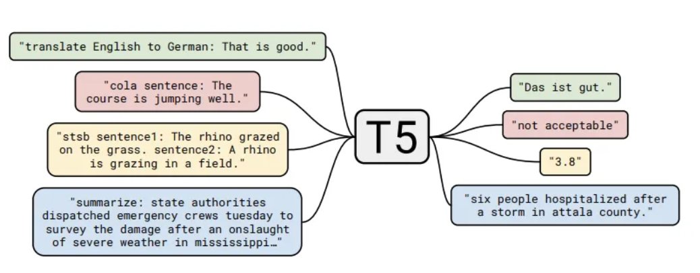

# Skoltech Industrial Immersion

### Soft prompts:
**Idea:** putting some random vectors (not tied to specific word embeddings from the vocabulary) in the input sequence and tuning them, with other parts of the pre-trained models fixed using gradient-based search.

- Train model to "fill" the descreate token set to continious form.
1. init noise vector
2. forward in through model to fill it between tokens.

**Extention:** use t5 model as a backbone to encode inital noise better.

https://medium.com/analytics-vidhya/t5-a-detailed-explanation-a0ac9bc53e51

#### AutoPrompt 
**IDEA:** take from set of words, e.g. the model or dataset vocabulary, k tokens and add them to prompt. Perform a gradient-based search to find that triggers.(Shin et al., 2020) 
- CODE: https://github.com/ucinlp/autoprompt

- ARTICAL: https://docs.yandex.ru/docs/view?tm=1683267885&tld=ru&lang=en&name=2010.15980.pdf&text=AutoPrompt%3A%20Eliciting%20Knowledge%20from%20Language%20Models%20with%20Automatically%20Generated%20Prompts&url=https%3A%2F%2Farxiv.org%2Fpdf%2F2010.15980.pdf&lr=20571&mime=pdf&l10n=ru&sign=b9d6ce39b4b7681501dc1fcc4bbeb8f8&keyno=0&nosw=1&serpParams=tm%3D1683267885%26tld%3Dru%26lang%3Den%26name%3D2010.15980.pdf%26text%3DAutoPrompt%253A%2BEliciting%2BKnowledge%2Bfrom%2BLanguage%2BModels%2Bwith%2BAutomatically%2BGenerated%2BPrompts%26url%3Dhttps%253A%2F%2Farxiv.org%2Fpdf%2F2010.15980.pdf%26lr%3D20571%26mime%3Dpdf%26l10n%3Dru%26sign%3Db9d6ce39b4b7681501dc1fcc4bbeb8f8%26keyno%3D0%26nosw%3D1

At each step, we compute a first-order approximation of the change in the log-likelihood
that would be produced by swapping the jth trigger token xtrig with another token from vacabulary. Then we identify a candidate set of the top-k tokens estimated to cause the greatest increase.

,where $w_{in}$ is the input embedding of w, and the gradient is taken with respect to the input embedding of trigger token.

For each candidate in this set, we then re-evaluate following equation on the updated prompt, and retain the prompt with the highest probability in the next step—this requires k forward passes of the model.

**Extention**: vocabulary set could be a set of relevant words, such as synonyms. However, we could extent the search domain with hyponymy-hypernymy relationships.

https://en.wikipedia.org/wiki/Hyponymy_and_hypernymy

#### Few-shot: 

**Idea:** choose few-shot support set by similarity of embedded with bert text prompts 

Liu et al. (2021) say that instead of randomly sampling some examples, taking in-context demonstrations similar to the query can substantially improve the performance; Lu et al. (2021) show that even the order of the demonstrations matters a lot and propose a way to determine the "optimal" order.

https://arxiv.org/abs/2101.06804

Relation Network is used for few-shot learning. 

1. Apply the Owl-ViT feature extractor to query and support set.
2. Concatenate fetures. 
3. The relation module is fed with the concatenation of the embedding of a query image with each class prototype, and it outputs a relation score for each couple (simple neural net). Applying a Softmax to the relation scores, we get a prediction for classes.
4. Add box prediciton head.

